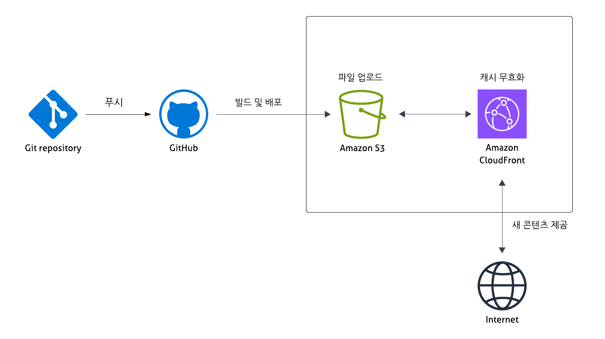
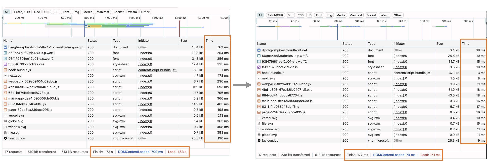

# 프론트엔드 배포 파이프라인

## 개요



### GitHub Actions 워크플로우

```yaml
// 워크플로우 이름
name: Deploy Next.js to S3 and invalidate CloudFront

//트리거 설정
on:
  push:
    branches:
      - main
      //main 브랜치에 코드가 푸시될 때마다 자동 실행
  workflow_dispatch:
  //GitHub Actions UI에서 수동 실행 가능

jobs:
  deploy:
    runs-on: ubuntu-latest
    //실행 환경: 최신 Ubuntu 환경에서 작업 실행(GitHub 호스팅 러너 사용)

    steps:
      //저장소 체크아웃
    - name: Checkout repository
      uses: actions/checkout@v4

      //의존성 설치
    - name: Install dependencies
      run: npm ci

      //프로젝트 빌드
    - name: Build
      run: npm run build

      //AWS 자격 증명 설정
    - name: Configure AWS credentials
      uses: aws-actions/configure-aws-credentials@v1
      with:
        aws-access-key-id: ${{ secrets.AWS_ACCESS_KEY_ID }}
        aws-secret-access-key: ${{ secrets.AWS_SECRET_ACCESS_KEY }}
        aws-region: ${{ secrets.AWS_REGION }}

      //S3 배포 - out/ 디렉토리 전체를 S3 버킷에 동기화
    - name: Deploy to S3
      run: |
        aws s3 sync out/ s3://${{ secrets.S3_BUCKET_NAME }} --delete
        //로컬에 없는 파일은 S3에서 자동 삭제

      //CloudFront 캐시 무효화
    - name: Invalidate CloudFront cache
      run: |
        aws cloudfront create-invalidation --distribution-id ${{ secrets.CLOUDFRONT_DISTRIBUTION_ID }} --paths "/*"
        //모든 경로(/*)의 캐시 무효화 -> 사용자에게 즉시 새 버전 제공
```

### 전체 배포 흐름

1. 개발자 코드 푸시: 메인 브랜치에 새로운 커밋이 추가됨
2. GitHub Actions 자동 트리거: 워크플로우 실행 환경 자동 생성
3. 저장소 코드 복제: 워크플로우 머신에 프로젝트 전체 코드 다운로드
4. 의존성 설치: node_modules 생성 및 프로젝트 환경 구성
5. 프로덕션 빌드: out/ 디렉토리에 정적 파일 생성
6. AWS 보안 인증: GitHub Secrets에 저장된 AWS 키로 IAM 인증 수행
7. S3 동기화 배포: 변경된 파일만 업로드, 삭제된 파일 제거
8. CDN 캐시 초기화

## 주요 링크

- S3 버킷 웹사이트 엔드포인트: http://hanghae-plus-front-5th-4-1.s3-website-ap-southeast-2.amazonaws.com/
- CloudFront 배포 도메인 이름: https://djprhgxahp6ev.cloudfront.net

## 주요 개념

- GitHub Actions과 CI/CD 도구
  - GitHub Actions는 GitHub에서 제공하는 자동화 도구로, 코드 저장소에 특정 이벤트(예: 코드 푸시)가 발생하면 미리 설정한 작업을 실행함
  - CI(Continuous Integration, 지속적 통합)는 개발자가 코드를 저장소에 올릴 때마다 자동으로 테스트하고 빌드하는 과정
  - CD(Continuous Deployment, 지속적 배포)는 검증된 코드를 자동으로 실제 서비스에 배포하는 과정
- S3와 스토리지
  - AWS S3(Simple Storage Service)는 클라우드 파일 보관 서비스로, 웹사이트 이미지, HTML, CSS, JS 파일 등을 버킷(폴더) 단위로 보관
- CloudFront와 CDN
  - CDN(Content Delivery Network)는 콘텐츠 전송 가속화 시스템으로 전 세계에 분산된 엣지 로케이션(캐시 서버) 통해 웹 콘텐츠를 사용자에게 빠르게 전달
  - CloudFront는 AWS에서 제공하는 CDN 서비스
- 캐시 무효화(Cache Invalidation)
  - 웹사이트의 이미지, HTML, CSS, JS 파일이 변경되었을 때 사용자에게 최신 콘텐츠를 제공하기 위해 캐시를 강제로 갱신하는 작업
- Repository secret과 환경변수
  - 비밀번호, API 키 등 AWS 인증 정보들을 안전하게 저장
  - 워크플로우 파일에서 `${{secrets.이름}}`으로 호출하여 사용

## CDN과 성능 최적화

- CDN 도입 전과 후의 성능 비교
  

### 개발자 도구 Network 탭 기준

| 항목             | CDN 도입 전 | CDN 도입 후 | 개선율 |
| ---------------- | ----------- | ----------- | ------ |
| Finish           | 1.73s       | 172ms       | 90.06% |
| DOMContentLoaded | 709ms       | 74ms        | 89.56% |
| Load             | 1.53s       | 151ms       | 90.13% |

- Finish: 네트워크 탭에서 측정한 모든 네트워크 요청이 끝나는 시간
- DOMContentLoaded: DOM Tree를 그리는 데 걸리는 시간 (HTML 구조 완성)
- Load: DOM Tree 구조를 포함하여, 이미지까지 화면에 로드되는 시간 (모든 리소스 로딩)

### 결과

CDN 도입으로 페이지 완료 시간과 전체 로딩 시간이 약 90% 단축
